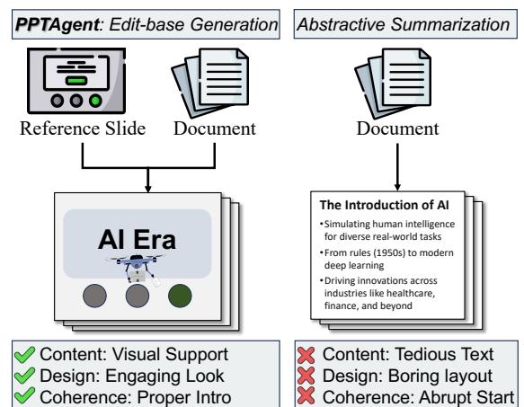
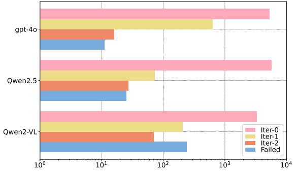
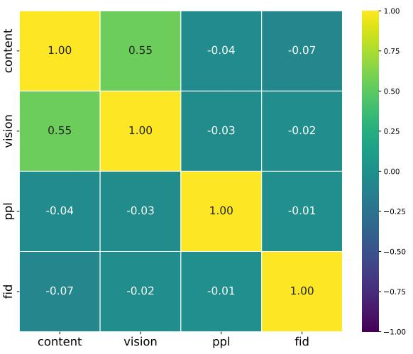

# *PPTAgent*: Generating and Evaluating Presentations Beyond Text-to-Slides

Hao Zheng1,2,*, Xinyan Guan1,2,∗ , Hao Kong3 , Jia Zheng1 , Hongyu Lin1

Yaojie Lu1 , Ben He1,2 , Xianpei Han1 , Le Sun1

1Chinese Information Processing Laboratory, Institute of Software, Chinese Academy of Sciences

2University of Chinese Academy of Sciences

3Shanghai Jiexin Technology

{zhenghao2022,guanxinyan2022,zhengjia,hongyu,luyaojie}@iscas.ac.cn

{xianpei,sunle}@iscas.ac.cn haokong@knowuheart.com

# Abstract

arXiv:2501.03936v1 [cs.AI] 7 Jan 2025

Automatically generating presentations from documents is a challenging task that requires balancing content quality, visual design, and structural coherence. Existing methods primarily focus on improving and evaluating the content quality in isolation, often overlooking visual design and structural coherence, which limits their practical applicability. To address these limitations, we propose*PPTAgent*, which comprehensively improves presentation generation through a two-stage, edit-based approach inspired by human workflows. *PPTAgent* first analyzes reference presentations to understand their structural patterns and content schemas, then drafts outlines and generates slides through code actions to ensure consistency and alignment. To comprehensively evaluate the quality of generated presentations, we further introduce *PPTEval*, an evaluation framework that assesses presentations across three dimensions: Content, Design, and Coherence. Experiments show that*PPTAgent* significantly outperforms traditional automatic presentation generation methods across all three dimensions. The code and data are available at https://github.com/icip-cas/PPTAgent.

# 1 Introduction

Presentations are a widely used medium for information delivery, valued for their visual effectiveness in engaging and communicating with audiences. However, creating high-quality presentations requires a captivating storyline, visually appealing layouts, and rich, impactful content (Fu et al., 2022). Consequently, creating well-rounded presentations requires advanced presentation skills and significant effort. Given the inherent complexity of presentation creation, there is growing interest in automating the presentation generation process (Mondal et al., 2024; Maheshwari et al.,

Figure 1: Comparison between our*PPTAgent* approach (left) and the conventional abstractive summarization method (right). Our method, which begins by editing a reference slide, aligns more closely with the human presentation creation process.

2024) by leveraging the generalization capabilities of large language models (LLM).

Existing approaches often adopt an end-to-end text-generation paradigm, focusing solely on textual content while neglecting layout design and presentation structures, making them impractical for real-world applications. For example, as shown in Figure 1, prior studies (Mondal et al., 2024; Sefid et al., 2021) treat presentation generation as an abstractive summarization task, focus primarily on textual content while overlooking the interactive nature of presentations. This results in simplistic and visually uninspiring outputs that fail to engage audiences.

However, automatically creating visually rich and structurally clear presentations remains challenging due to the complexity of data formats and the lack of effective evaluation frameworks. First, most presentations are saved in PowerPoint's XML format, which is inherently tedious and redundant (Gryk, 2022). This complex format poses signifi-

* These authors contributed equally

*Stage Ⅰ: Presentation Analysis*

*Stage Ⅱ: Presentation Generation*

Figure 2: Overview of the *PPTAgent* workflow. *Stage I: Presentation Analysis* involves analyzing the input presentation to cluster slides into groups and extract their content schemas. *Stage II: Presentation Generation* generates new presentations guided by the outline, incorporating feedback mechanisms to ensure robustness.

cant challenges for LLMs in interpreting the presentation layout and structure, let alone generating appealing slides in an end-to-end fashion. Second, and more importantly, the absence of comprehensive evaluation frameworks exacerbates this issue. Current metrics like perplexity and ROUGE (Lin, 2004) fail to capture essential aspects of presentation quality such as narrative flow, visual design, and content impact. Moreover, ROUGE-based evaluation tends to reward excessive textual alignment with input documents, undermining the brevity and clarity crucial for effective presentations. These limitations highlight the urgent need for advancements in automated presentation generation, particularly in enhancing visual design and developing comprehensive evaluation frameworks.

Rather than creating complex presentations from scratch in a single pass, presentations are typically created by selecting exemplary slides as references and then summarizing and transferring key content onto them (Duarte, 2010). Inspired by this process, we design *PPTAgent* to decompose presentation generation into an iterative, edit-based workflow, as illustrated in Figure 2. In the first stage, given a document and a reference presentation,*PPTAgent* analyzes the reference presentations to extract semantic information, providing the textual description that identifies the purpose and data model of each slide. In the Presentation Generation stage, *PPTAgent* generates a detailed

presentation outline and assigns specific document sections and reference slides to each slide. For instance, the framework selects the opening slide as the reference slide to present meta-information, such as the title and icon. *PPTAgent* offers a suite of editing action APIs that empower LLMs to dynamically modify the reference slide. By breaking down the process into discrete stages rather than end-to-end generation, this approach ensures consistency, adaptability, and seamless handling of complex formats.

To comprehensively evaluate the quality of generated presentations, we propose *PPTEval*, a multidimensional evaluation framework. Inspired by Chen et al. (2024a) and Kwan et al. (2024),*PPTEval* leverages the MLLM-as-a-judge paradigm to enable systematic and scalable evaluation. Drawing from Duarte (2010), we categorized presentation quality into three dimensions: Content, Design, and Coherence, providing both quantitative scores and qualitative feedback for each dimension. Our human evaluation studies validated the reliability and effectiveness of*PPT Eval* PPT .

Results demonstrate that our method effectively generates high-quality presentations, achieving an average score of 3.67 across the three dimensions evaluated by *PPTEval*. These results, covering a diverse range of domains, highlight a high success rate of 97.8%, showcasing the versatility and robustness of our approach.

Our main contributions can be summarized as follows:

- We propose *PPTAgent*, a novel framework that redefines automatic presentation generation as an edit-based workflow guided by reference presentations.
- We introduce *PPTEval*, the first comprehensive evaluation framework that assesses presentations across three key dimensions: Content, Design, and Coherence.
- We publicly released the *PPTAgent* and *PPTEval* codebase, along with a curated presentation dataset, to facilitate future research in automatic presentation generation.

# 2 PPTAgent

In this section, we first establish the formulation of the presentation generation task. Subsequently, we describe the framework of our proposed*PPTAgent*, which operates in two distinct stages. In stage I, we analyze the reference presentation by clustering similar slides and extracting their content schemas. This process aims to enhance the expressiveness of the reference presentation, thereby facilitating subsequent presentation generation. In stage II, given an input document and the analyzed reference presentation, we aim to select the most suitable slides and generate the target presentation through an interactive editing process based on the selected slides. An overview of our proposed workflow is illustrated in Figure 2.

### 2.1 Problem Formulation

*PPTAgent* is designed to generate an engaging presentation via an edit-based process. We will provide formal definitions for both*PPTAgent* and the conventional method, illustrating their divergence.

The conventional method for creating each slide S can be described in Equation 1, where n represents the number of elements on the slide, and C denotes the source content composed of sections and figures. Each element on the slide, ei , is defined by its type, content, and styling attributes, such as (Textbox, "Hello", {border,size, position, . . . }).

$${\mathbf{S}}=\sum_{i=1}^{n}e_{i}=f(C)\qquad\qquad(1)$$

Compared to the conventional method, *PPTAgent* adopts an edit-based generation

paradigm for creating new slides, addressing challenges in processing spatial relationships and designing styles. This approach generates a sequence of actions to modify existing slides. Within this paradigm, both the input document and the reference presentation serve as inputs. This process can be described as Equation 2, where m represents the number of generated actions. Each action ai represents a line of executable code, and Rj is the reference slide being edited.

$$A=\sum_{i=1}^{m}a_{i}=f\left(C\mid R_{j}\right)\qquad\qquad(2)$$

#### 2.2 Stage I: Presentation Analysis

To facilitate presentation generation, we first cluster slides in the reference presentation and extract their content schemas. This structured semantic representation helps LLMs determine which slides to edit and what content to convey in each slide.

Slide Clustering Slides can be categorized into two main types based on their functionalities: slides that support the structure of the presentation (e.g., opening slides) and slides that convey specific content (e.g., bullet-point slides). We employ different clustering algorithms to effectively cluster slides in the presentation based on their textual or visual characteristics. For structural slides, we leverage LLMs to infer the functional role of each slide and group them accordingly, as these slides often exhibit distinctive textual features. For the remaining slides, which primarily focus on presenting specific content, we employ a hierarchical clustering approach leveraging image similarity. For each cluster, we infer the layout patterns of each cluster using MLLMs. Further details regarding this method can be found in Appendix C.

Schema Extraction After clustering slides to facilitate the selection of slide references, we further analyzed their content schemas to ensure purposeful alignment of the editing. Given the complexity and fragmentation of real-world slides, we utilized the context perception capabilities of LLMs (Chen et al., 2024a) to extract diverse content schemas. Specifically, we defined an extraction framework where each element is represented by its category, modality, and content. Based on this framework, the schema of each slide was extracted through LLMs' instruction-following and structured output capabilities. Detailed instructions are provided in Appendix E.

### 2.3 Stage II: Presentation Generation

In this stage, we begin by generating an outline that specifies the reference slide and relevant content for each slide in the new presentation. For each slide, LLMs iteratively edit the reference slide using interactive executable code actions to complete the generation process.

Outline Generation Following human preferences, we instruct LLMs to create a structured outline composed of multiple entries. Each entry specifies the reference slide, relevant document section indices, as well as the title and description of the new slide. By utilizing the planning and summarizing capabilities of LLMs, we provide both the document and semantic information extracted from the reference presentation to generate a coherent and engaging outline for the new presentation, which subsequently orchestrates the generation process.

Slide Generation Guided by the outline, the slide generation process iteratively edits a reference slide to produce the new slide. To enable precise manipulation of slide elements, we implement five specialized APIs that allow LLMs to edit, remove, and duplicate text elements, as well as edit and remove visual elements. To further enhance the comprehension of slide structure, inspired by Feng et al. (2024) and Tang et al. (2023), we convert slides from their raw XML format into an HTML representation, which is more interpretable for LLMs. For each slide, LLMs receive two types of input: text retrieved from the source document based on section indices, and captions of available images. The new slide content is then generated following the guidance of the content schema.

Subsequently, LLMs leverage the generated content, HTML representation of the reference slide, and API documentation to produce executable editing actions. These actions are executed in a REPL1 environment, where the system detects errors during execution and provides real-time feedback for self-correction. The self-correction mechanism leverages intermediate results to iteratively refine the editing actions, enhancing the robustness of the generation process.

Figure 3: This figure illustrates the evaluation process in*PPTEval*, which assesses three key dimensions: content, design, and coherence. Content evaluates the quality of text and images within the slides. Design examines the visual consistency and appeal. Coherence focuses on the logical flow of the presentation. Each dimension is rated on a scale from 1 to 5, with detailed feedback provided for improvement.

# 3 PPTEval

To address the limitations of existing automated metrics for presentation evaluation, we introduce *PPTEval*, a comprehensive framework for assessing presentation quality from multiple perspectives. The framework provides scores on a 1-to-5 scale and offers detailed feedback to guide the improvement of future presentation generation methods. The overall evaluation process is depicted in Figure 3, with the detailed scoring criteria and examples provided in Appendix B.

Drawing from Duarte (2008, 2010), we have identified three key dimensions for evaluating presentation quality:

Content: The content dimension evaluates the information presented on the slides, focusing on both text and images. We assess content quality from three perspectives: the amount of information, the clarity and quality of textual content, and the support provided by visual content. High-quality textual content is characterized by clear, impactful text that conveys the proper amount of information. Additionally, images should complement and reinforce the textual content, making the information more accessible and engaging. To evaluate content quality, we employ MLLMs on slide images, as slides cannot be easily comprehended in a plain text format.

Design: Good design not only captures attention but also enhances content delivery. We evaluate the design dimension based on three aspects: color schemes, visual elements, and overall design. Specifically, the color scheme of the slides should

<b>Content: 5 **The textual content is impac4ul, and Content: 5 The textual content is impactful, and Content: 5** The textual content is impactful, and well supported by images **Design: 4 Cohesive design, but overlaps reduce appeal. Design: 4 Cohesive design, but overlaps reduce appeal. Design: 4** Cohesive design, but overlaps reduce appeal. Evaluation Target MLLM Judge **Coherence: 4** Minor flaws presented in the logical structure **Logical Structure** Slide-1: Describe xx Slide-n: Conclude xx … *Extract*

1 https://en.wikipedia.org/wiki/ Read-eval-print_loop

have clear contrast to highlight the content while maintaining harmony. The use of visual elements, such as geometric shapes, can make the slide design more expressive. Finally, good design should adhere to basic design principles, such as avoiding overlapping elements and ensuring that design does not interfere with content delivery.

Coherence: Coherence is essential for maintaining audience engagement in a presentation. We evaluate coherence based on the logical structure and the contextual information provided. Effective coherence is achieved when the model constructs a captivating storyline, enriched with contextual information that enables the audience to follow the content seamlessly. We assess coherence by analyzing the logical structure and contextual information extracted from the presentation.

# 4 Experiment

# 4.1 Dataset

Data Collection Existing presentation datasets, such as Mondal et al. (2024); Sefid et al. (2021); Sun et al. (2021); Fu et al. (2022), have two main issues. First, they are mostly stored in PDF or JSON formats, which leads to a loss of semantic information, such as structural relationships and styling attributes of elements. Additionally, these datasets are primarily derived from academic reports, limiting their diversity. To address these limitations, we introduce *Zenodo10K*, a new dataset sourced from Zenodo (European Organization For Nuclear Research and OpenAIRE, 2013), an open digital repository hosting diverse artifacts from different domains. We have curated 10,448 presentations from this source and made them publicly available to support further research. Following Mondal et al. (2024), we sampled 50 presentations across five domains to serve as reference presentations. Additionally, we collected 50 documents from the same domains to be used as input documents. Details of the sampling criteria are provided in Appendix A.

Data Preprocessing We utilized VikParuchuri (2023) to extract both textual and visual content from the documents. The extracted textual content was then organized into sections using Qwen2.5- 72B-Instruct (Yang et al., 2024). For the visual content, captions were generated using Qwen2-VL-72B-Instruct (Wang et al., 2024a). To minimize redundancy, we identified and removed duplicate images if their image embeddings had a cosine sim-

| Domain | Document |  |  | Presentation |  |
| --- | --- | --- | --- | --- | --- |
|  | #Chars | #Figs | #Chars | #Figs | #Pages |
| Culture | 12,708 | 2.9 | 6,585 | 12.8 | 14.3 |
| Education | 12,305 | 5.5 | 3,993 | 12.9 | 13.9 |
| Science | 16,661 | 4.8 | 5,334 | 24.0 | 18.4 |
| Society | 13,019 | 7.3 | 3,723 | 9.8 | 12.9 |
| Tech | 18,315 | 11.4 | 5,325 | 12.9 | 16.8 |

Table 1: Statistics of the dataset used in our experiments, detailing the number of characters ('#Chars') and figures ('#Figs'), as well as the number of pages ('#Pages').

ilarity score exceeding 0.85. Similarly, slides were excluded if their text embeddings had a cosine similarity score above 0.8 compared to the preceding slide, as suggested by Fu et al. (2022). Detailed statistics of the dataset are presented in Table 1.

#### 4.2 Experimental Settings and Baseline

Models We evaluate our method using three state-of-the-art models: GPT-4o-2024-08-06 (GPT-4o), Qwen2.5-72B-Instruct (Qwen2.5, Yang et al., 2024), and Qwen2-VL-72B-Instruct (Qwen2-VL, Wang et al., 2024a). These models are categorized according to the specific modalities they handle, whether textual or visual, as indicated by their subscripts. Specifically, we define configurations as combinations of a language model (LM) and a vision model (VM), such as Qwen2.5LM+Qwen2- VLVM.

During experiments, we allow up to two iterations of self-correction per slide generation task, producing 5 × 10 × 10 = 500 presentations per configuration. We use Chen et al. (2024b) and Wu et al. (2020) to compute the text and image embeddings respectively. All open-source LLMs are deployed using the VLLM framework (Kwon et al., 2023) on a cluster of 8 NVIDIA A100 GPUs. The total computational cost for these experiments is approximately 500 GPU hours.

Baseline We adopt the methodology described in Bandyopadhyay et al. (2024) as our baseline. This approach employs a multi-staged end-to-end model to generate narrative-rich presentations, with an image similarity-based ranking algorithm to add images to the slides. The baseline method is evaluated using either GPT-4o or Qwen2.5, as it does not require the necessary processing of visual information. Each configuration generates 5 × 10 = 50 presentations, given that it does not require an input

| Setting Existing Metrics |  |  |  |  |  | PPTEval |  |  |
| --- | --- | --- | --- | --- | --- | --- | --- | --- |
| Language Model | Vision Model | SR(%)↑ | PPL↓ | FID↓ | Content↑ | Design↑ | Coherence↑ | Avg.↑ |
| Baseline |  |  |  |  |  |  |  |  |
| GPT-4oLM | – | – | 110.6 | – | 2.98 | 2.33 | 3.24 | 2.85 |
| Qwen2.5LM | – | – | 122.4 | – | 2.96 | 2.37 | 3.28 | 2.87 |
| PPTAgent |  |  |  |  |  |  |  |  |
| GPT-4oLM | GPT-4oVM | 97.8 | 459.7 | 7.48 | 3.25 | 3.24 | 4.39 | 3.62 |
| Qwen2-VLLM | Qwen2-VLVM | 43.0 | 322.3 | 7.32 | 3.13 | 3.34 | 4.07 | 3.51 |
| Qwen2.5LM | Qwen2-VLVM | 95.0 | 313.9 | 6.20 | 3.28 | 3.27 | 4.48 | 3.67 |
| Ablation |  |  |  |  |  |  |  |  |
| PPTAGENT |  | 95.0 | 313.9 | 6.20 | 3.28 | 3.27 | 4.48 | 3.67 |
| w/o Outline |  | 91.0 | 2304.3 | 6.94 | 3.24 | 3.30 | 3.36 | 3.30 |
| 164.8 | w/o Schema | 78.8 |  | 7.12 | 3.08 | 3.23 | 4.04 | 3.45 |
| w/o Structure |  | 92.2 | 189.9 | 7.66 | 3.28 | 3.25 | 3.45 | 3.32 |
| w/o CodeRender |  | 74.6 | 231.0 | 7.03 | 3.27 | 3.34 | 4.38 | 3.66 |

Table 2: Performance comparison of the baseline, our proposed PPTAgent framework, and its ablation variants. Results are reported using existing metrics—Success Rate (SR), Perplexity (PPL), and FID (Heusel et al., 2017)—as well as our proposed*PPT Eval* PPT metrics, which assess Content, Design, Coherence, and their average score.

| Domain | SR (%) | PPL | FID | PPTEval |
| --- | --- | --- | --- | --- |
| Culture | 93.0 | 185.3 | 5.00 | 3.70 |
| Education | 94.0 | 249.0 | 7.90 | 3.69 |
| Science | 96.0 | 500.6 | 6.07 | 3.56 |
| Society | 95.0 | 396.8 | 5.32 | 3.59 |
| Tech | 97.0 | 238.7 | 6.72 | 3.74 |

Table 3: Evaluation results under the configuration of Qwen2-VLLM+Qwen2-VLVM in different domains, using the success rate (SR), PPL, FID and the average PPTEval score across three evaluation dimensions.

presentation. We do not report the success rate and FID of the baseline method for the same reason.

### 4.3 Evaluation Metrics

We evaluated the presentation generation using the following metrics:

- Success Rate (SR) measures the robustness of the generation task by determining the percentage of presentations where all slides are successfully generated.
- Perplexity (PPL) measures the likelihood of the language model generating the given sequence. Following Bandyopadhyay et al. (2024), we calculate the average perplexity of slides within a presentation using GPT-2.. A lower perplexity score indicates that the textual content is more fluent.
- FID (Heusel et al., 2017) measures the similarity between the generated presentation and

the exemplar presentation in the feature space. Due to the limited sample size, we calculate the FID using a 64-dimensional output vector.

- PPTEval measures the comprehensive quality of presentations across three dimensions: coherence, content, and design. We employ GPT-4o as the judge model.
### 4.4 Result & Analysis

Table 2 presents the performance comparison between*PPTAgent* and baseline methods, revealing that:

PPTAgent Enhances LLMs' Presentation Generation Capabilities As demonstrated in Table 2, our approach empowers LLMs to produce well-rounded presentations with a remarkable success rate, achieving ≥ 95% success rate for both Qwen2.5LM+Qwen2-VLVM and GPT-4oLM+GPT-4oVM. This is a significant improvement compared to the highest accuracy of 10% for session-based template editing tasks as reported in Guo et al. (2023). This improvement can be attributed to three main factors: 1)*PPTAgent* concentrates on content modifying, thereby avoiding intricate stying operations. 2) Our streamlined API design allows LLMs to execute tasks with ease. 3) The code interaction module enhances LLMs' comprehension of slides and offers opportunities for self-correction, enabling them to generate accurate actions robustly. Moreover, detailed performance of Qwen2.5LM+Qwen2-VLVM across various domains, as illustrated in Table 3, underscores the robustness of our approach.

Figure 4: The number of iterative self-corrections required to generate a single slide under different models.

PPTAgent Significantly Improves Overall Presentation Quality By adopting an Edit-based paradigm, *PPTAgent* allows elements within the presentation to inherit well-designed styling attributes from existing presentations. When using GPT-4o, experimental results demonstrate comprehensive improvements over the baseline. We significantly surpass the baseline method in the design dimension under *PPTEval* (3.24 vs 2.33), as the presentations generated by the baseline method lack basic design efforts. Furthermore, we achieved substantial enhancements in coherence (4.39 vs 3.28) and content (3.25 vs 2.98) dimensions, as the semantic information extracted during the Presentation Analysis stage effectively guided the LLMs.

Open-Source LLMs Rival GPT-4o in Performance GPT-4o consistently demonstrates outstanding performance across various evaluation metrics, highlighting its advanced capabilities. While Qwen2-VL exhibits limitations in linguistic proficiency due to the trade-offs from multimodal post-training, GPT-4o maintains a clear advantage in handling language tasks. However, the introduction of Qwen2.5 successfully mitigates these linguistic deficiencies, bringing its performance on par with GPT-4o, and achieving the best performance. This underscores the significant potential of open-source LLMs as competitive and highly capable presentation agents.

### 4.5 Ablation Study

To better understand the impact of each component in our proposed method, we performed ablation studies using four different configurations. Specifically, we evaluated the method by: (1) randomly selecting a slide as the edit target (w/o Outline), (2) omitting structural information during outline generation (w/o Structure), (3) replacing

| Corelation Content Design Coherence Avg. |  |  |  |  |
| --- | --- | --- | --- | --- |
| Pearson | 0.70 | 0.90 | 0.55 | 0.71 |
| Spearman | 0.73 | 0.88 | 0.57 | 0.74 |

Table 4: The correlation scores between human ratings and LLM ratings under different dimensions (Coherence, Content, Design). All presented data of similarity exhibit a p-value below 0.05, indicating a statistically significant level of confidence.

the slide representation with the method described in Guo et al. (2023) (w/o CodeRender), and (4) removing guidance from the slide schema (w/o Schema). These configurations were tested using the Qwen2.5LM+Qwen2-VLVM.

Code Representation Enhances LLMs' Comprehension As shown in Table 2, the removal of the Code Render component leads to a significant drop in the model's success rate (SR) from 95.0 to 74.6. This underscores the critical role of code representation in leveraging LLMs' coding capabilities to improve their overall comprehension.

Presentation Analysis is Essential for Generating Targeted Presentations The removal of the outline and structural information significantly degrades coherence (from 4.48 to 3.36/3.45), underscoring their crucial role in maintaining logical flow. Furthermore, the absence of slide schema hinders LLMs from generating targeted content effectively, resulting in a drop in success rate from 95.0 to 78.8.

#### 4.6 Error Analysis

Figure 4 illustrates the number of iterations required to generate a slide using different models. Although GPT-4o exhibits superior self-correction capabilities compared to Qwen2.5, Qwen2.5 encounters fewer errors in the first iteration (Iter-0). Additionally, we observed that Qwen2-VL experiences errors more frequently and has poorer selfcorrection capabilities, likely due to its multimodal post-training (Wang et al., 2024a). Ultimately, all three models successfully corrected more than half of the errors, demonstrating that our iterative selfcorrection mechanism effectively ensures the success of the generation process.

### 4.7 Effectiveness of PPTEval

Human Agreement Evaluation Despite Chen et al. (2024a) have highlighted the impressive

Figure 5: Correlation heatmap between existing automated evaluation metrics and*PPT Eval* PPT .

human-like discernment of LLMs in various generation tasks. However, it remains crucial to assess the correlation between LLM evaluations and human evaluations in the context of presentations. This necessity arises from findings by Laskar et al. (2024), which indicate that LLMs may not be adequate evaluators for complex tasks. Table 4 shows the correlation of ratings between humans and LLMs. The average Pearson correlation of 0.71 exceeds the scores of other evaluation methods (Kwan et al., 2024), indicating that*PPTEval* aligns well with human preferences.

Moreover, the heatmap in Figure 5 reveals the limitations of existing metrics when compared with the Content and Design dimensions of*PPTEval*. In our experiments, we observed that PPL predominantly captures text fluency and is susceptible to the fragmented nature of slide text, leading to ineffective measurements with frequent outliers. Similarly, FID merely quantifies stylistic similarity to reference presentations rather than design quality, as conformity to reference styles does not necessarily indicate superior design. These findings underscore the necessity of *PPTEval* for comprehensive and effective presentation evaluation.

# 5 Related Works

Automated Presentation Generation Recent proposed methods for slide generation can be categorized into rule-based and template-based based on how they handle element placement. Rulebased methods, such as those proposed by Mondal et al. (2024) and Li et al. (2021), often focus on enhancing textual content but neglect the visualcentric nature of presentations, leading to outputs that lack engagement. Template-based methods, including Cachola et al. (2024) and industrial solutions like Tongyi, rely on pre-designed templates to create visually appealing presentations. However, their dependence on extensive manual effort for template annotation significantly limits scalability and flexibility.

LLM Agent Numerous studies (Li et al., 2024; Deng et al., 2024; Wang et al., 2024c) have explored the potential of LLMs to act as agents assisting humans in a wide array of tasks. For example, Zheng et al. (2024); Wang et al. (2024b) demonstrate the capability of LLMs to accomplish tasks by generating executable actions and correcting errors based on feedback. Furthermore, Guo et al. (2023) introduces an evaluation system that assesses the ability of LLMs to perform multi-turn, multimodal slide editing tasks using APIs, which inspired the use of LLMs for complex tasks as proposed in this study.

LLM as a Judge LLMs have demonstrated strong capabilities in instruction following and context perception, leading to their widespread use as judges (Liu et al., 2023; Zheng et al., 2023). Further research by Zhuge et al. (2024) enhanced LLMs' abilities through external modules and functions, while Chen et al. (2024a) validated the feasibility of using multimodal large language models(MLLMs) as judges. Additionally, Kwan et al. (2024) introduced a multi-dimensional evaluation framework for multi-turn conversations, which inspired the development of our proposed*PPT Eval* PPT .

# 6 Conclusion

In this paper, we introduced*PPTAgent*, which conceptualizes presentation generation as a two-stage presentation editing task completed through the abilities of LLMs to understand and generate code. This approach leveraged the textual feature and layout patterns to organize slides into different functional groups. Our experiments across data from multiple domains have demonstrated the superiority of our method. Moreover, our proposed *PPTEval* ensured the assessability of presentations. This research provides a new paradigm for generating slides under unsupervised conditions and offers fresh insights for future work in presentation generation.

