**iPhone 16 Pro** Hello,AppleIntelligence. Buy 买

Get $180–$650 in credit toward iPhone 16 or iPhone 16 Pro when you trade in iPhone 12 or higher. Buy

*

Overview 概述 Buy 买

*

当您以旧换新 iPhone 12 或更⾼版本时,可获得iPhone 16 或 iPhone 16 Pro 180-650 美元的抵⽤⾦。 买

**From $999 or $41.62/mo. for 24 mo. 999** 美元或 **41.62** 美元/⽉起。 **24** 个⽉。 d Apple Intelligence available now Apple Intelligence 现已推出 9 9

## **Get the highlights.** Watch the film

**The first iPhone built** 第⼀部 **iPhone** 诞⽣ **for Apple Intelligence.** 对于苹 **果情报。 Personal, private, 个⼈的、私⼈** 的、 **powerful. 强⼤的。 <** )

## **Take a closer look.**

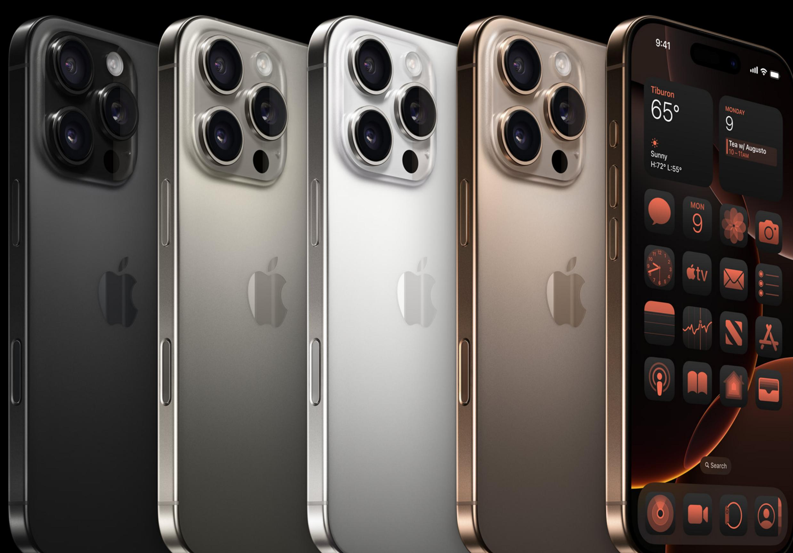

# **Strength. Beauty. Titanium. ⼒量。美丽。** 钛。

**iPhone 16 Pro features a Grade 5 titanium design with a new, refined microblasted texture. Titanium has one of the highest strength-to-weight ratios of any metal, making these models incredibly strong and impressively light. iPhone 16 Pro comes in four stunning finishes — including new Desert Titanium. iPhone 16 Pro** 采⽤ 5 **级钛⾦属设计,**

**具有全新精致的微喷砂纹理。钛是所有 ⾦属中强度重量⽐最⾼的⾦属之⼀,使 这些模型变得异常坚固且极其轻盈。 iPhone 16 Pro 拥有四种令⼈惊叹的饰 ⾯,包括全新的 Desert Titanium**。

**Internal design improvements including a 100 percent recycled aluminum thermal substructure and back glass optimizations that further dissipate heat — enable up to 20 percent better sustained performance than iPhone 15 Pro. So you can do all the things you love — like high-intensity gaming — for longer. 内部设计改进**——包括 **100% 再⽣铝制 散热结构和进⼀步散热的背⾯玻璃优化** ——**使持续性能⽐ iPhone 15 Pro** 提⾼ 了 **20%。因此,您可以更⻓时间地做所**

**有您喜欢的事情,例如⾼强度游戏。**

**Premium Grade 5 titanium is**

**Premium Grade 5 titanium is**

**exceptionally durable**

**exceptionally durable**

优质 5 **级钛⾦属⾮常耐⽤**

优质 5 **级钛⾦属⾮常耐⽤**

**New display technology allows us to route display data under active pixels with no distortion, resulting in thinner borders for larger 6.3-inch and 6.9-inch Super Retina XDR displays that feel great in your hand.**

显示屏

显示屏

**新的显示技术使我们能够在活动像素下**

**iPhone 16 Pro is splash, water, and dust resistant. It also has our latestgeneration Ceramic Shield material that's two times tougher than any smartphone glass. Talk about durable. iPhone 16 Pro 防溅、防⽔、防尘。** 它 **还具有我们最新⼀代的陶瓷屏蔽材料,** T K

**路由显示数据⽽不会失真,从⽽使更⼤** 的 **6.3** 英⼨和 **6.9** 英⼨**Super Retina XDR 显示器的边框更薄,⼿感极佳。**

**其硬度是任何智能⼿机玻璃的两倍。谈 论耐⽤。**

**iPhone 16 Pro is built for Apple Intelligence, the personal intelligence system that helps you write, express yourself, and get things done effortlessly. With groundbreaking privacy protections, it gives you peace of mind that no one else can access your data — not even Apple.**

**Boost your productivity Express yourself visually A new era for Siri**

**Explore new tools that help you write, focus, and communicate.**

**Make a Genmoji right in the keyboard to match any conversation. Want to create a disco ball pigeon? You got it. Just provide a description. Awareness of your personal context enables Siri to help you in ways that are unique to you. Need your passport number while booking a flight? Siri can help find what you're looking for, without compromising your privacy. Writing Tools can proofread your text and rewrite different versions until the tone and wording are just right, and summarize selected text with a tap. They're available nearly everywhere you write, including thirdparty apps.**

**The Image Playground app lets you create unique images in seconds based on a description, a concept, or even a person from your Photos library. Experiment with image styles like animation, illustration, and sketch. Richer language understanding and an enhanced voice make communicating with Siri even more natural. For example, if you stumble over your words, Siri still knows what you're getting at. Just hit record in the Notes or Phone app to capture audio recordings and transcripts. Apple Intelligence generates summaries of your transcripts, so you can get the most important info at a glance.**

**With Clean Up, you can remove distracting background objects from your photos with just a tap — so you can perfect a shot while staying true to the original image. Not sure how to do something on iPhone, like adjust the background blur on a portrait? With expansive product knowledge, Siri can give you step-by-step instructions in a snap. Priority messages in Mail elevate timesensitive messages to the top of your inbox — like an invitation that has a deadline today or a check-in reminder for your flight this afternoon.**

## **Great powers come with great privacy.**

**Apple Intelligence is designed to protect your privacy at every step. It's integrated into the core of iPhone through on-device processing. So it's aware of your personal information without collecting your personal information.**

**And with groundbreaking Private Cloud Compute, Apple Intelligence can draw on larger Apple-designed server-based models, running on Apple silicon, to handle more complex requests for you while protecting your privacy.**

**Learn more about Apple Intelligence**

# **Take total Camera Control.**

Play

**Now you can take the perfect photo or video in record time. Camera Control gives you an easier way to quickly access camera tools. Simply slide your finger to adjust camera functions like exposure or depth of field, and toggle through each lens or use digital zoom to frame your shot — just how you like it.**

**Camera Control features a two-stage shutter that lets you automatically lock focus and exposure with a light press so you can reframe your shot without losing focus on your subject.**

**How to use Camera Control**

**Click to launch the Camera app. Click again to instantly take a photo.**

**Click and hold to start recording video. A light press opens controls like zoom.**

# **4K 120 fps Dolby Vision. Cinemasterful.**

A herd of Icelandic horses, captured in stunning 4K 120 fps Dolby Vision

**iPhone 16 Pro takes video capture to a whole new level with 4K 120 fps Dolby Vision — our highest resolution and frame rate combo yet. Enabled by the new 48MP Fusion camera with secondgeneration quad-pixel sensor and our powerful A18 Pro chip, iPhone 16 Pro lets you record 4K 120 fps Dolby Vision in video mode or slo-mo.**

**And now you can adjust the playback speed after capture in the redesigned Photos app, giving you greater editing capabilities. To add a dreamy quality to your shot, try out the new half-speed option. Or for a cinematic effect, slow it right down to 24 fps playback.**

## **Highest-quality video in a smartphone**

**iPhone 16 Pro also provides a big leap in audio performance with four studioquality mics for higher-quality recording. They provide a lower noise floor so you get more true-to-life sounds. New Spatial Audio capture makes your videos sound more immersive when listening with AirPods. And thanks to wind noise reduction, the audio quality is even clearer.**

# **Audio Mix. Make your voice heard.**

**Powered by advanced intelligence and Spatial Audio capture, Audio Mix lets you adjust the way voices sound in your videos using three different voice options. Want to decrease background sound? Or just focus on the voices that are in frame? Simply select the mix and adjust intensity to get the sound you want after video capture.**

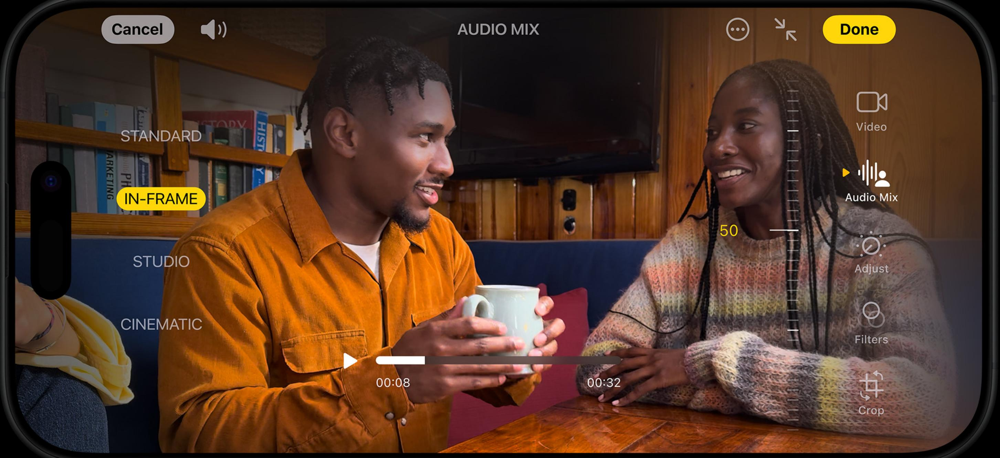

#### **In-frame**

**Only captures the voices of the people on camera, even if people off-camera are talking during the recording.**

### **Studio**

**Makes voices sound like you're recording in a professional studio equipped with sound-dampening walls. Great for vloggers or**

### **Cinematic**

**Captures all of the voices around you and consolidates them toward the front of the screen — just like sound is formatted for the movies.**

**podcasters because the recording will sound like the mic is close to the subject's mouth, even if it's a few feet away.**

## **Shot on iPhone 16 Pro.**

**Go behind the scenes of The Weeknd's groundbreaking music video to learn how the powerful camera features on iPhone 16 Pro deliver more creative freedom and flexibility than ever before. The "Dancing in the Flames" cinematographer Erik Henriksson films the video in dreamlike slow motion using 4K 120 fps Dolby Vision on iPhone 16 Pro. Thanks to Camera Control, he could make technical decisions by simply sliding a finger to adjust camera functions like exposure or focal length — all without missing a beat.**

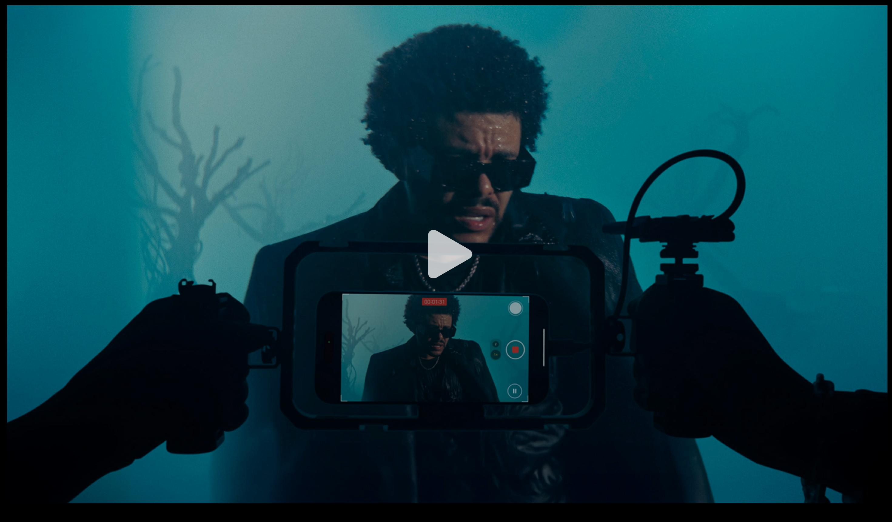

# **New 48MP Ultra Wide camera. Viva la resolution.**

**iPhone 16 Pro adds a second 48MP camera to the Pro camera system. The new 48MP Ultra Wide camera has a more advanced quad-pixel sensor for super-high-resolution 48MP ProRAW and HEIF photos with autofocus.**

**So you can capture a mesmerizing new level of detail in macro photos and sweeping, wide-angle shots.**

Macro 13 mm 24 mm 28 mm 35 mm 48 mm 120 mm

**0.5x Ultra Wide**

**More zoom? Boom. Now you can shoot in 120 mm with the 5x Telephoto camera on both Pro models and get sharper close-ups from farther away. With multiple framing options, it's like having seven pro lenses in your pocket, everywhere you go.**

**Choose your Photographic Style. Change it up. Change it back.**

> **Our latest generation of Photographic Styles gives you greater creative flexibility than ever before, so you can make every photo even more you. And thanks to advances in our image pipeline, you can now reverse any style, anytime.**

## **Lock in your look.**

**We've created new styles that let you dial in your exact desired look with more advanced skin-tone rendering and set it across your photos.**

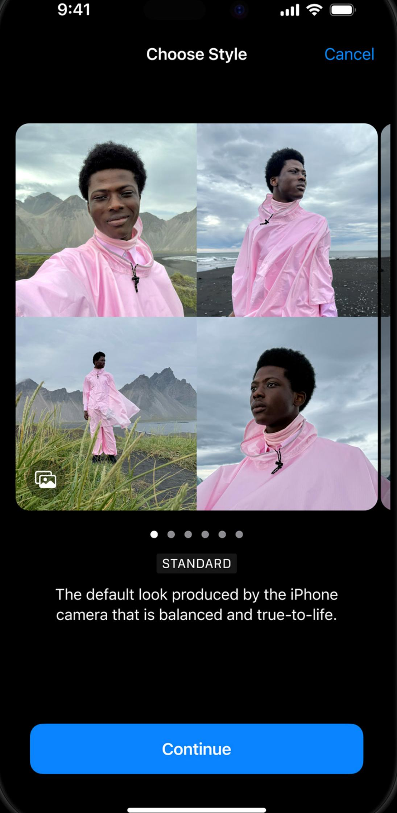

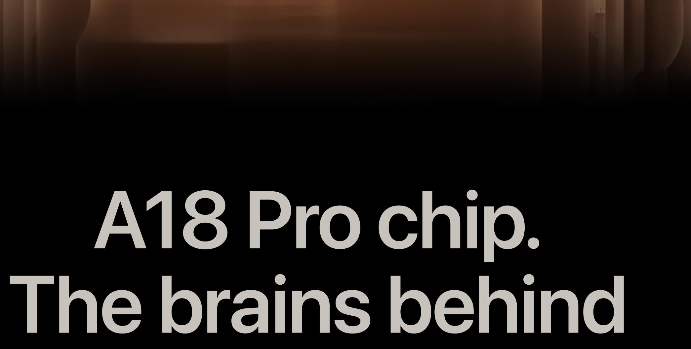

# **Apple Intelligence.**

**A phenomenally powerful chip, A18 Pro enables Apple Intelligence with a faster Neural Engine, an improved CPU and GPU, and a big jump in memory bandwidth. It also drives advanced video and photo features like Camera Control, and it delivers our best-ever graphics performance for AAA gaming.**

**New 16-core Neural Engine is faster and more efficient, supercharging Apple Intelligence**

**New 6-core CPU, the fastest in a smartphone, runs complex workloads with less power**

**New 6-core GPU gives you enhanced graphics performance**

**17% increase in total system memory bandwidth, the highest ever in iPhone, for outstanding performance**

| Compare with | iPhone 12 Pro |  |
| --- | --- | --- |
| Up to |  | Up to |
| 60% faster 60% faster |  | 2x faster 2x faster |
| 6-core CPU |  | 6-core GPU |

DEATH STRANDING DIRECTOR'S CUT

## **In a whole new light.**

**With up to two times faster hardware-accelerated ray tracing, A18 Pro makes games look and feel beautifully lifelike — with more fluid graphics and realistic lighting.**

**And with Game Mode in iOS 18, you'll get better sustained frame rates for continuous play and improved responsiveness if you're using wireless controllers and AirPods.**

## **Up to 2x faster hardwareaccelerated ray tracing than A17 Pro**

## **A huge leap in battery life. Stellar.h A in battery life.**

**iPhone 16 Pro gives you longer battery life — and iPhone 16 Pro Max delivers the best battery life ever on an iPhone. How? An optimized internal design fits larger batteries, which work together with the A18 Pro chip to deliver incredibly powerefficient performance. Even with so many new capabilities.**

**Snap on a new MagSafe charger for even faster wireless charging — up to 25W with a 30W power adapter or higher, enabling up to 50% charge in around 30 minutes.** i j

**Up to 33 hours video playback on iPhone 16 Pro Maxg**

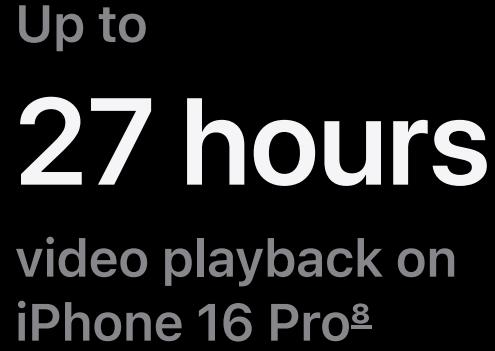

**Compare with**

**iPhone 12 Pro**

**10 more hours Up to 10 more hours** **Up to**

**video playback on iPhone 16 Pro**

**video playback on iPhone 16 Pro Max**

**16 more hours**

**16 more hours**

# **iOS 18. Customize. Stylize. Mesmerize.**

**Personalize your Home Screen. Tint your icons with any color. Rearrange and resize apps and widgets. You can even lock or hide apps to protect sensitive information — it's your call.**

**Choose your controls. Swap out your Lock Screen controls for ones you love to use more often. Or you can assign a control to the Action button.**

**Find your favorite shots faster. In the redesigned**

**Photos app, your Collections are automatically**

**organized by topic, like People & Pets.**

**Learn more about iOS 18**

# **No signal? There's a satellite for that.**

**When you don't have cell service or Wi-Fi, iPhone 16 Pro can connect you to a satellite, so you can stay in touch or get the assistance you need.**

## **Messages via satellite lets**

**you send and receive messages and Tapbacks when you're off the grid, right from the Messages app. Your iPhone will help you connect to a satellite, so you can text over iMessage or SMS.** l

### **Roadside Assistance via**

**satellite can get you help for things like a flat tire or a dead car battery. iPhone will connect you with a roadside assistance provider, who can dispatch help to your exact location — even if you're off the grid.** mn

**See how Roadside Assistance works**

**Roadside Assistance via satellite is included for free for two years with iPhone 16 Pro** l

**iPhone also has vital safety**

**features that can help save lives. If you try calling 911 for urgent help but don't have cell service or Wi-Fi, you can use iPhone to text emergency services over satellite.** mm

**See how Emergency SOS via satellite works**

**When you're within range and make a 911 emergency call, iPhone 16 Pro gives you the option to start sharing a live feed with 911 responders for quick and effective assistance.** l

**Crash Detection uses hardware sensors and advanced motion algorithms to detect a severe car crash, then call 911 and notify your emergency contacts when you can't — even when you don't have service. m<**

# **Designed to make a difference.**

## **Environment**

**All Apple data centers including those that power Apple Intelligence — run on 100% renewable electricity.**

**iPhone 16 Pro uses more recycled metals than ever:**

**over 95% recycled lithium in the battery. 100% recycled gold in the plating of the USB-C connector and camera wires.** mp

**100% recycled copper foil in the MagSafe inductive charger.**

**The packaging for iPhone 16 Pro is 100% fiber based for the first time. And it's thinner, which reduces the carbon impact for shipping.** mT mh

**Learn about Apple and the environment**

## **Privacy**

#### **Apple Intelligence protects your privacy at**

**every step. With ondevice processing and Private Cloud Compute, no one but you can access your data — not even Apple.**

### **The new Passwords app**

**makes it even easier to access account passwords, passkeys, Wi-Fi passwords, twofactor authentication codes, and more. It stores them securely and syncs across your**

**devices with end-to-end**

# **You can also control**

**which contacts to share with an app, rather than giving it access to all your contacts. And you can choose to share more contacts over time.** **devices with end-to-end encryption.**

**Learn about Apple and privacy**

## **Accessibility**

**Eye Tracking makes it possible to navigate your iPhone and use your favorite apps just by moving your eyes, thanks to the power of machine learning and the front-facing camera.**

**Music Haptics matches the iPhone Taptic Engine with the rhythm of songs. So people who are deaf or hard of hearing can enjoy the Apple Music catalog in a whole new way.**

**Vocal Shortcuts helps people with severe atypical speech record sounds that trigger specific actions on iPhone — set a timer, take a screenshot, scroll up and down, and more.**

**Learn about Apple and accessibility**

## **Significant others.**

### **iPhone and Mac**

With iPhone Mirroring, you can view your iPhone screen on your Mac and control it without picking up your phone. Continuity features also let you answer calls or messages right from your Mac. You can even copy images, video, or text from your iPhone and paste it all into a different app on your Mac. And with iCloud, you can access your files from either device.

**iPhone and Apple Watch**

**iPhone and AirPods**

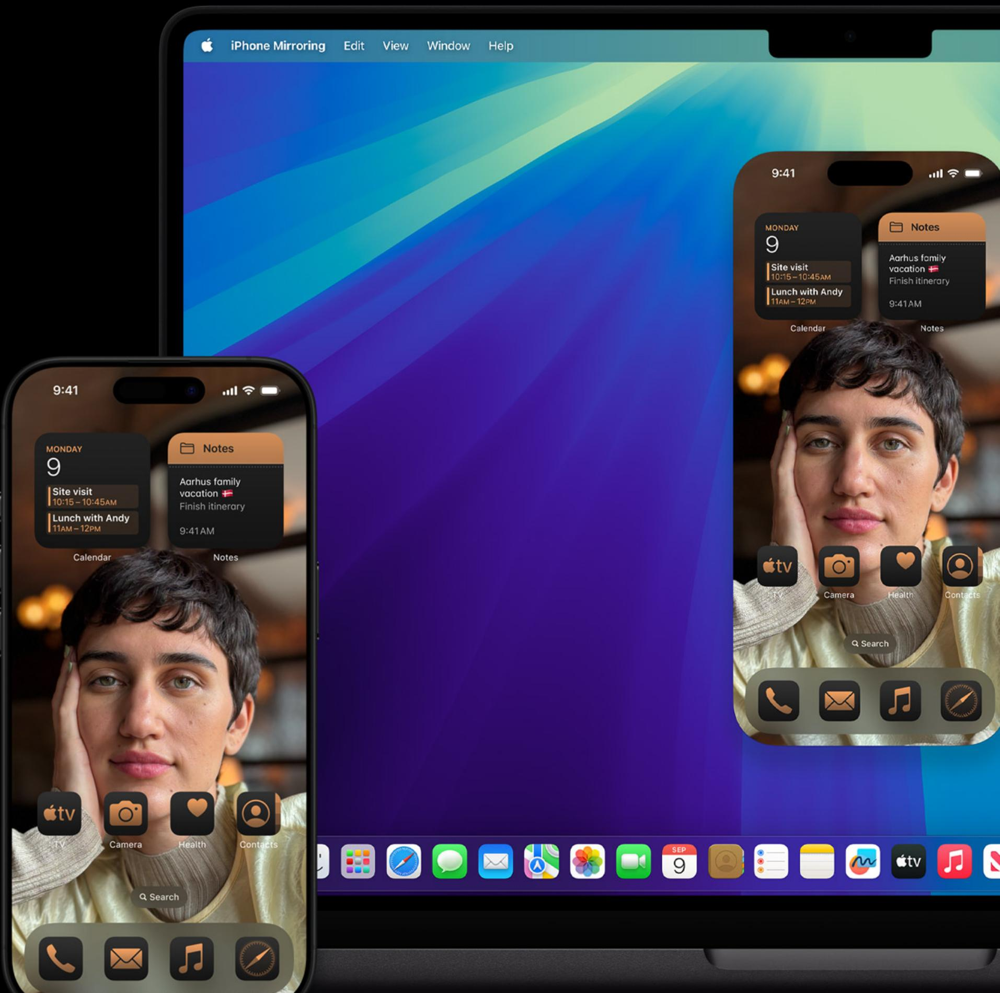

## **Why Apple is the best place to buy iPhone.** Shop iPhone

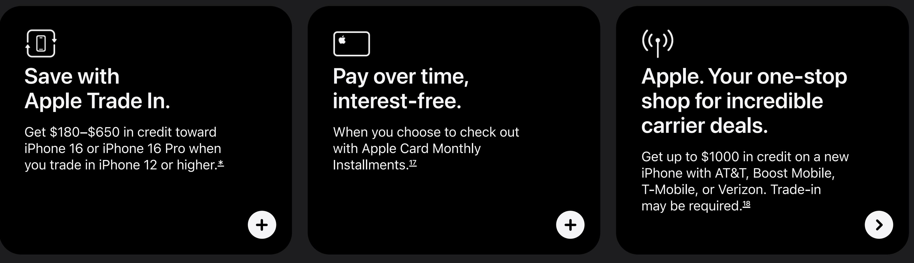

## **Keep exploring iPhone.** Explore all iPhone

#### New **iPhone 16 Pro**

**From $999 or $41.62/mo. for 24 mo.** d

Currently viewing

Buy

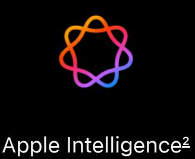

A18 Pro chip with 6-core GPU

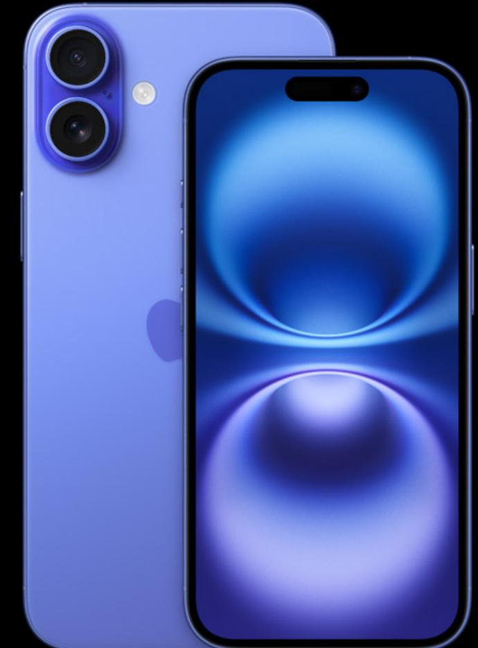

New **iPhone 16**

**From $799 or $33.29/mo. for 24 mo.** d

Apple Intelligence 9

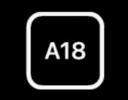

A18 chip with 5-core GPU

| Camera Control | Camera Control |
| --- | --- |
| Pro camera system | Advanced dual-camera system |
| Our most advanced 48MP Fusion camera | Advanced 48MP Fusion camera |
| 5x Telephoto camera | 2x Telephoto |
| 48MP Ultra Wide camera | 12MP Ultra Wide camera |
| Up to 33 hours video playback ^f | Up to 27 hours video playback ^f |

## **iPhone**

#### Explore iPhone **Explore All iPhone iPhone 16 Pro iPhone 16 iPhone 15 iPhone 14 iPhone SE Compare iPhone Switch from Android** Shop iPhone **Shop iPhone iPhone Accessories Apple Trade In Carrier Deals at Apple Financing** More from iPhone **iPhone Support AppleCare+ for iPhone iOS 18 Apple Intelligence Apps by Apple iPhone Privacy iCloud+ Wallet, Pay, Card Siri**

* Trade-in values will vary based on the condition, year, and configuration of your eligible trade-in device. Not all devices are eligible for credit. You must be at least 18 years old to be eligible to trade in for credit or for an Apple Gift Card. Trade-in value may be applied toward qualifying new device purchase, or added to an Apple Gift Card. Actual value awarded is based on receipt of a qualifying device matching the description provided when estimate was made. Sales tax may be assessed on full value of a new device purchase. In-store trade-in requires presentation of a valid photo ID (local law may require saving this information). Offer may not be available in all stores, and may vary between in-store and online trade-in. Some stores may have additional requirements. Apple or its trade-in partners reserve the right to refuse or limit quantity of any trade-in transaction for any reason. More details are available from Apple's trade-in partner for trade-in and recycling of eligible devices. Restrictions and limitations may apply.

- j. Financing available to qualified customers, subject to credit approval and credit limit, and requires you to select Citizens One Apple iPhone Payments or Apple Card Monthly Installments (ACMI) as your payment type at checkout at Apple. You'll need to select AT&T, Boost Mobile, T-Mobile, or Verizon as your carrier when you checkout. An iPhone purchased with ACMI is always unlocked, so you can switch carriers at any time, subject to your carrier's terms. Taxes and shipping on items purchased using ACMI are subject to your card's variable APR, not the ACMI 0% APR. ACMI is not available for purchases made online at special storefronts. The last month's payment for each product will be the product's purchase price, less all other payments at the monthly payment amount. ACMI financing is subject to change at any time for any reason, including but not limited to, installment term lengths and eligible products. See the Apple Card Customer Agreement for more information about ACMI. Additional Citizens One Apple iPhone Payments terms are here.
- m. Apple Intelligence is available in beta on all iPhone 16 models, iPhone 15 Pro, and iPhone 15 Pro Max, with Siri and device language set to English (Australia, Canada, Ireland, New Zealand, South Africa, UK, or U.S.), as an iOS 18 update. Additional features and languages will be available in April, with more languages coming over the course of the year. Languages supported in 2025 include Chinese, English (India, Singapore), French, German, Italian, Japanese, Korean, Portuguese, Spanish, and Vietnamese.
- p. Display size: The display has rounded corners that follow a beautiful curved design, and these corners are within a standard rectangle. When measured as a standard rectangular shape, the screen is 6.27 inches (iPhone 16 Pro) or 6.86 inches (iPhone 16 Pro Max) diagonally. Actual viewable area is less.
- r. iPhone 16 Pro and iPhone 16 Pro Max are splash, water, and dust resistant and were tested under controlled laboratory conditions with a rating of IP68 under IEC standard 60529 (maximum depth of 6 meters up to 30 minutes). Splash, water, and dust resistance are not permanent conditions. Resistance might decrease as a result of normal wear. Do not attempt to charge a wet iPhone; refer to the user guide for cleaning and drying instructions. Liquid damage not covered under warranty.
- u. Battery life increase based on the video playback hours of iPhone 16 Pro Max compared to iPhone 15 Pro Max.
- v. Accessories sold separately.
- w. Testing conducted by Apple in August 2024 using preproduction iPhone 16 Pro and iPhone 16 Pro Max units and software, USB-C Charge Cable with Apple USB-C Power Adapter (20W Model A2305), and Apple MagSafe Chargers (1-meter Model A2580 and 2-meter Model A3250) with Apple USB-C Power Adapter (30W Model A2164). Fast-charge testing conducted with drained iPhone units. Times measured from the appearance of the Apple logo as the unit started up. Charge time varies with settings and environmental factors; actual results will vary.
- x. All battery claims depend on network configuration and many other factors; actual results will vary. Battery has limited recharge cycles and may eventually need to be replaced. Battery life and charge cycles vary by use and settings. See apple.com/batteries and apple.com/iphone/battery.html for more information.
- z. Roadside Assistance, Emergency SOS, and Messages via satellite are included for free for two years with the activation of any iPhone 14 or later model. Connection and
	- response times vary based on location, site conditions, and other factors. Messages via satellite requires a carrier plan. SMS messaging via satellite is available on supported carriers. SMS message rates may apply. See support.apple.com/kb/HT213885 for more information.
- j{. Fees are determined by the roadside assistance provider, and can vary based on your location and the type of assistance provided. See support.apple.com/105098 for more information.
- jj. Service is included for free for two years with the activation of any iPhone 16 model. Connection and response times vary based on location, site conditions, and other factors. See support.apple.com/kb/HT213885 for more information.
- jm. iPhone 16 and iPhone 16 Pro can detect a severe car crash and call for help. Requires a cellular connection or Wi-Fi calling.
- jp. On a mass balance allocation.
- jr. Breakdown of U.S. retail packaging by weight. Adhesives, inks, and coatings are excluded from our calculations of plastic content and packaging weight.
- ju. This increase in boxes we can fit onto a pallet excludes pallets shipped to the following locations: U.S., Puerto Rico, U.S. Virgin Islands, Guam, and Canada.
- jv. Requires an iPhone and Apple Watch with second-generation Ultra Wideband chip. Ultra Wideband availability varies by region.
- jw. Apple Card Monthly Installments (ACMI) is a 0% APR payment option that is only available if you select it at checkout in the U.S. for eligible products purchased at Apple Store locations, apple.com, the Apple Store app, or by calling 1-800-MY-APPLE, and is subject to credit approval and credit limit. See support.apple.com/102730 for more information about eligible products. Existing customers: See your Customer Agreement for your variable APR. As of December 1, 2024, the variable APR on new Apple Card accounts ranges from 18.49% to 28.74%. You must elect to use ACMI at checkout. If you buy an ACMI-eligible product with a one-time payment on Apple Card at checkout, that purchase is subject to your Apple Card's variable APR, not the ACMI 0% APR. Taxes and shipping on items purchased using ACMI are subject to your Apple Card's variable APR, not the ACMI 0% APR. In order to buy an iPhone with ACMI, you must select one of the following carriers: AT&T, Boost Mobile, T-Mobile, or Verizon. An iPhone purchased with ACMI is always unlocked, so you can switch carriers at any time, subject to your carrier's terms. ACMI is not available for purchases made online at the following special stores: Apple Employee Purchase Plan; participating corporate Employee Purchase Programs; Apple at Work for small businesses; Government and Veterans and Military Purchase Programs; or on refurbished devices. The last month's payment for each product will be the product's purchase price, less all other payments at the monthly payment amount. ACMI is subject to change at any time for any reason, including but not limited to installment term lengths and eligible products. See the Apple Card Customer Agreement for more information about ACMI.

To access and use all Apple Card features and products available only to Apple Card users, you must add Apple Card to Wallet on an iPhone or iPad that supports and has the latest version of iOS or iPadOS. Apple Card is subject to credit approval, available only for qualifying applicants in the United States, and issued by Goldman Sachs Bank USA, Salt Lake City Branch.

If you reside in the U.S. territories, please call Goldman Sachs at 877-255-5923 with questions about Apple Card.

- jx. AT&T iPhone 16 Special Deal: Monthly price (if shown) reflects net monthly payment, after application of AT&T trade-in credit applied over 36 months with purchase of an iPhone 16 Pro, iPhone 16 Pro Max, or iPhone 16 and trade-in of eligible smartphone. Receive credit with purchase of an iPhone 16 Pro or iPhone 16 Pro Max of either $1000, $830, or $350 (based upon the model and condition of your trade-in smartphone). Receive credit with purchase of an iPhone 16 of either $800 or $350 (based upon the model and condition of your trade-in smartphone). Max bill credits will not exceed the cost of the device. Requires upgrade of an existing line or activation of a new line and purchase of a new iPhone 16 Pro, iPhone 16 Pro Max, or iPhone 16 on qualifying 36 month 0% APR installment plan, subject to carrier credit qualification. Customers purchasing this offer through Apple cannot add the Next Up Anytime option. $0 down for well qualified customers only, or down payment may be required and depends on a variety of factors. Tax on full retail price due at sale. Requires activation on eligible AT&T unlimited plan. AT&T may temporarily slow data speeds if the network is busy. If you cancel eligible wireless service, credits will stop and you will owe the remaining device balance. Activation/Upgrade Fee: $35. Trade in device may not be on existing installment plan. Bill credits are applied as a monthly credit over the 36 month installment plan. Credits start within 3 bills. Will receive catchup credits once credits start. Wireless line must be on an installment agreement, active, and in good standing for 30 days to qualify. Installment agreement starts when device is shipped. To get all credits, device must remain on agreement for entire term and you must keep eligible service on device for entire installment term. Limited time offer; subject to change. Limits: one trade-in per qualifying purchase and one credit per line. May not be combinable with other offers, discounts, or credits. Purchase, financing, other limits, and restrictions apply. Price for iPhone 16 and iPhone 16 Plus includes $30 AT&T connectivity discount. Activation required.
Boost Mobile iPhone 16 Special Deal: Buy an iPhone 16 Pro, iPhone 16 Pro Max, iPhone 16, or iPhone 16 Plus and get $1000 in bill credits (not to exceed the cost of the iPhone) applied over 36 months. No trade-in required. If you are trading in a device with this deal, trade-in value will be applied as additional bill credits over 36 months. Monthly price (if shown) reflects net monthly payment, after application of $1000 in bill credit (not to exceed the cost of the iPhone purchased) and trade-in credit (if applicable) applied over 36 months respectively. Requires activation of a new line, Boost Mobile Infinite Access plan and purchase on qualifying 36-month 0% APR installment plan, subject to carrier credit qualification. After making 12 installment payments, you may upgrade to a new iPhone and get up to $1000 in bill credits (not to exceed the cost of the iPhone) applied over 36 months for the new iPhone on the Infinite Access plan and purchase on new qualifying 36-month 0% APR installment plan, subject to carrier credit qualification. Tax on full retail price due at sale. If you cancel eligible wireless service, credits will stop and you will owe the remaining device balance. Bill credits are applied as a monthly credit over the 36-month installment plan. Trade-in credits start within 3 bills. Installment agreement starts when device is shipped. To get all credits, device must remain on agreement for entire term and you must keep eligible service on device for entire installment term. Limited-time offer; subject to change. Limits: one credit per line. May not be combined with other offers, discounts, or credits. Purchase, financing, other limits, and restrictions apply. Price for iPhone 16 and iPhone 16 Plus includes $30 Boost Mobile connectivity discount. Activation required.

T-Mobile iPhone 16 Special Deal: Monthly price (if shown) reflects net monthly payment, after application of T-Mobile trade-in credit applied over 24 months with purchase of an iPhone 16 Pro, iPhone 16 Pro Max, iPhone 16, or iPhone 16 Plus and trade-in of eligible smartphone. Receive credit with purchase of an iPhone 16 Pro, iPhone 16 Pro Max, iPhone 16, or iPhone 16 Plus of $1000, $800, or $400 for customers on a Go5G Next plan (based upon the model and condition of your trade-in smartphone); or $800 or $400 for customers on a Go5G Plus plan (based upon the model and condition of your trade-in smartphone). Offer excludes customers on Go5G Next First Responder, Go5G Plus First Responder, Go5G Next Military, Go5G Plus Military, Go5G Next 55, and Go5G Plus 55 plans. Max bill credits will not exceed the cost of the device. Credit comprised of (i) Apple instant trade-in credit at checkout and (ii) T-Mobile monthly bill credits applied over 24 months. Allow 2 bill cycles from valid submission and validation of trade-in. Tax on pre-credit price due at sale. Limited-time offer; subject to change. Qualifying credit, data plan, and trade-in in good condition required. Max 4 promotional offers on any iPhone per account. May not be combinable with some offers or discounts. Price for iPhone 16 and iPhone 16 Plus includes $30 T-Mobile connectivity discount. Activation required. Contact T-Mobile before cancelling service to continue remaining bill credits on current device, or credits stop & balance on required finance agreement is due.

Verizon iPhone 16 Special Deal: Monthly price (if shown) reflects net monthly payment, after application of Verizon trade-in credit applied over 36 months with purchase of an iPhone 16 Pro, iPhone 16 Pro Max, iPhone 16, or iPhone 16 Plus. Customers on an Unlimited Ultimate plan receive: $1000 credit (based upon the model and condition of your trade-in smartphone) with purchase of an iPhone 16 Pro or iPhone 16 Pro Max; $930 credit (based upon the model and condition of your trade-in smartphone) with purchase of an iPhone 16 Plus; or $830 credit (based upon the model and condition of your trade-in smartphone) with purchase of an iPhone 16. Customers on an Unlimited Plus plan receive $730 credit (based upon the model and condition of your trade-in smartphone) with purchase of an iPhone 16 Pro, iPhone 16 Pro Max, iPhone 16, or iPhone 16 Plus. Max bill credits will not exceed the cost of the device. Must be an existing Verizon customer. Credit comprised of (i) Apple instant trade-in credit at checkout and (ii) Verizon monthly bill credits applied over 36 months. Customer must remain in the Verizon Device Payment Program for 36 months to receive the full benefit of the Verizon bill credits. Bill credits may take 1-2 bill cycles to appear. If it takes two cycles for bill credits to appear, you'll see the credit for the first cycle on your second bill in addition to that month's credit. Requires purchase and activation of a new iPhone 16 Pro, iPhone 16 Pro Max, iPhone 16, or iPhone 16 Plus with the Verizon Device Payment Program at 0% APR for 36 months, subject to carrier credit qualification, and iPhone availability and limits. Taxes and shipping not included in monthly price. Sales tax may be assessed on full value of new iPhone. Requires eligible unlimited service plan. Requires trade-in of eligible device in eligible condition. Must be at least 18 to trade-in. Apple or its trade-in partners reserve the right to refuse or limit any trade-in transaction for any reason. In-store trade-in requires presentation of a valid, government-issued photo ID (local law may require saving this information). In-store promotion availability subject to local law; speak to a Specialist to learn more. Limited-time offer; subject to change. Additional terms from Apple, Verizon, and Apple's trade-in partners may apply. Price for iPhone 16 and iPhone 16 Plus includes $30 Verizon connectivity discount. Activation required.

- jz. Battery life claim refers to larger models. All battery claims depend on network configuration and many other factors; actual results will vary. Battery has limited recharge cycles and may eventually need to be replaced. Battery life and charge cycles vary by use and settings. See apple.com/batteries and apple.com/iphone/battery.html for more information.
DEATH STRANDING DIRECTOR'S CUT © 2024 Sony Interactive Entertainment Inc. / KOJIMA PRODUCTIONS Co., Ltd. / HIDEO KOJIMA. Published by 505 Games. Features are subject to change. Some features, applications, and services may not be available in all regions or all languages.

Some features require specific hardware and software. For more information, see Feature Availability.

#### iPhone iPhone 16 Pro

| Shop and Learn | Account | Apple Store | For Business | Apple Values |
| --- | --- | --- | --- | --- |
| Store | Manage Your Apple Account | Find a Store | Apple and Business | Accessibility |
| Mac | Apple Store Account | Genius Bar | Shop for Business | Education |
| iPad | iCloud.com | Today at Apple | For Education | Environment |
| iPhone |  | Group Reservations |  | Inclusion and Diversity |
| Watch | Entertainment | Apple Camp | Apple and Education | Privacy |
|  | Apple One |  | Shop for K-12 |  |
| Vision |  | Apple Store App |  | Racial Equity and Justice |
| AirPods | Apple TV+ | Certified Refurbished | Shop for College | Supply Chain |
|  | Apple Music |  |  |  |
| TV & Home | Apple Arcade | Apple Trade In | For Healthcare | About Apple |
| AirTag |  | Financing | Apple in Healthcare |  |
| Accessories | Apple Fitness+ | Carrier Deals at Apple |  | Newsroom |
|  | Apple News+ |  | Mac in Healthcare | Apple Leadership |
| Gift Cards |  | Order Status | Health on Apple Watch |  |
|  | Apple Podcasts | Shopping Help |  | Career Opportunities |
| Apple Wallet | Apple Books |  | Health Records on iPhone and iPad | Investors |
| Wallet | App Store |  |  | Ethics & Compliance |
| Apple Card |  |  | For Government | Events |
| Apple Pay |  |  | Shop for Government | Contact Apple |
| Apple Cash |  |  | Shop for Veterans and Military |  |

More ways to shop: Find an Apple Store or other retailer near you. Or call 1-800-MY-APPLE.
